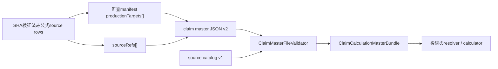

# Phase 3-1 Task 12 Claim Master Schema v2 Design

## 1. 目的

Task 13のsource-side schema auditで確認した次の13,950件の`schema-gap`を、公式上の意味を失わず保存できるclaim master schema v2へ再設計する。

| gap category | 件数 | 代表locator | 不足している能力 |
| --- | ---: | --- | --- |
| `numeric-composite-unit` | 13,539 | `r6-service-codes-2-xlsx / workbook-order=38;row=7` | service code、最終合成単位、算定条件を同じ請求行として保持する能力 |
| `unit-addition-or-other-operation` | 352 | `r6-service-codes-2-xlsx / workbook-order=38;row=941` | 固定単位加算、人数乗算、割合加算等を区別して保持する能力 |
| `condition-rate-calculation-structure` | 59 | `r6-service-codes-2-xlsx / workbook-order=38;row=908` | 基準単位へ条件付き乗率を順番・丸め境界付きで適用する能力 |

Task 12はschema、Domain型、validator及びtestsまでを対象とする。算定ルールの実行、公式値のseed転記、Task 13の再監査は後続Taskとする。

## 2. 設計判断

1. 6つのclaim masterファイルを`schemaVersion = 2`へ一括移行する。v1との後方互換及びv1/v2混在は認めない。
2. `sources.json`は別契約であるためsource catalog `schemaVersion = 1`を維持する。
3. 既存6 master kindを維持し、7番目の`calculation-rules.json`は追加しない。
4. 公式請求コード表の1論理行を`ServiceCodeMasterRow`の保存単位とし、service codeと算定ルールを同じentryへ保持する。
5. `ServiceCodeUnitRule`は`fixed-composite-unit`、`unit-addition`、`formula`の閉じたunionとする。
6. 全production entryの単一source fieldを、field単位の根拠を示す非空`sourceRefs`配列へ置き換える。
7. service code条件は期間付き`conditionDefinitions`で定義し、entryはkeyで参照する。
8. `service-codes`は公式請求行の正本、`basic-rewards`及び`additions`は正規化した算定componentとする。
9. manifestとの完全一致はrepository audit testで検証し、runtime validatorへmanifestを渡さない。
10. 共通validatorは期間逆転・重複を拒否するが、制度上のretirementを許可する。継続必須集合の穴はmaster別testで検査する。

## 3. 非対象

- `ServiceCodeUnitRule`の実行エンジン。
- composite unitの再計算と公式最終単位との数値一致。
- Task 13 production seedの投入。
- Task 13 manifest全14,709行の再分類。
- source catalog schemaの版上げ。
- 任意演算を記述できる汎用式AST。
- 公式資料の長文を計算fieldへ複製すること。

## 4. アーキテクチャ



### 4.1 責務境界

- JSON Schema v2はproperty、型、enum、union kind固有field及びadditional property禁止を検証する。
- Runtime validatorはsource catalog、正本、期間、condition、selector、component及び循環を検証する。
- Repository audit testはmanifestの`productionTargets`とproduction entryの`sourceRefs`を照合する。
- Runtime bundleはmanifestを保持しない。
- 後続calculatorはvalidator済みのtyped unionだけを受け取り、生JSON又は自由記述式を解釈しない。

## 5. Claim master file v2共通契約

6つのmasterファイルは次のrootを持つ。

```json
{
  "schemaVersion": "2",
  "masterKind": "service-codes",
  "entries": []
}
```

`service-codes.json`だけは追加で`conditionDefinitions`を必須にする。他のmaster kindでは同propertyを禁止する。

全entryの共通fieldは次とする。

```text
key
effectiveFrom
effectiveTo
sourceRefs[]
values
```

v1の`sourceDocumentId`、`sourceSha256`及び`sourceLocator`は廃止する。

## 6. Source provenance

### 6.1 Domain型

```text
ClaimSourceRef
  documentId
  sha256
  locator
  evidenceRole
  supports[]
```

`evidenceRole`は次の閉集合とする。

```text
authoritative
correction
cross-check
```

`supports`は非空・重複禁止とし、次の閉集合を使用する。

```text
service-identity
selectors
unit-rule-kind
unit-rule-value
unit-rule-target
unit-rule-step
unit-rule-rounding
conditions
effective-period
master-values
```

### 6.2 必須coverage

- 全entryは`effective-period`を有効正本で覆う。
- service code entryは`service-identity`、`selectors`及び`unit-rule-kind`を有効正本で覆う。
- `fixed-composite-unit`は`unit-rule-value`を有効正本で覆う。
- `unit-addition`は`unit-rule-value`及び`unit-rule-step`を有効正本で覆う。`units-per-count`と`percentage-of-target`は`unit-rule-target`も必須とし、percentage amountだけ`unit-rule-rounding`も必須とする。
- `formula`は`unit-rule-value`、`unit-rule-target`、`unit-rule-step`及び`unit-rule-rounding`を有効正本で覆う。
- `conditionSelectors`が非空のservice code entryは`conditions`を有効正本で覆う。
- condition definitionは`conditions`及び`effective-period`を有効正本で覆う。
- その他のmaster entryは`master-values`を有効正本で覆う。

### 6.3 有効正本の確定

各`supports`項目について有効正本documentをちょうど1件に確定する。訂正関係はsource catalogの`corrects`を`newer correction -> older corrected document`方向の有向edgeとして扱う。

1. 対象supportを持つ`authoritative`及び`correction` refのdocument集合をcandidateとする。`cross-check`はcandidateにしない。
2. `correction` refはcatalog上でcandidate内のauthoritative documentへ直接又は推移的に到達できなければならない。
3. catalogの全経路を探索するため、中間correction documentをsource refsへ列挙することは必須にしない。ただし基点authoritative refと採用する末端correction refは必須とする。
4. candidate間の到達判定で通過するcatalog nodeを含むreachable subgraphにcycleがあれば拒否する。
5. catalog上の推移的到達関係を使い、他のcandidateから到達されない最新側のmaximal candidate documentを求め、ちょうど1件でなければ拒否する。同一原典から複数訂正へ分岐してmaximalが複数になる場合は競合として拒否する。
6. 1 correctionが複数原典を訂正する合流は、そのcorrectionが唯一のmaximalで、全candidateへ到達できる場合だけ受理する。
7. maximal documentから全authoritative candidateへ到達できなければchain外正本の競合として拒否する。
8. 同じdocument、locator、evidence roleのrefを複数置かず、`supports`を1 refへ統合する。同じ有効正本document内の複数locatorは許可する。

`unit-rule`をkind、value、target、step、roundingへ分割することで、異なる資料が相補的に同一ruleを裏付ける場合もsupportごとに正本を一意化する。

## 7. Service code v2 Domain model

```text
ServiceCodeMasterRow
  Key
  ServiceCode
  OfficialLabel
  ServiceKind
  Selectors[]
  ConditionSelectors[]
  UnitRule
  ComponentRefs[]
  EffectiveFrom
  EffectiveTo
  SourceRefs[]
```

### 7.1 identity

- `OfficialLabel`は公式サービス内容略称を外側空白なしで保持する。
- 同じ適用期間の同一service codeに異なるofficial labelが存在する場合は拒否する。
- 公式labelを生成、翻訳又は正規化しない。
- `Selectors`と`ConditionSelectors`は非空文字列の重複なし配列とする。

### 7.2 billing unit

`BillingUnit`は次の閉集合とする。

```text
per-day
per-month
per-use
```

## 8. ServiceCodeUnitRule union

### 8.1 fixed-composite-unit

公式service code表が最終合成単位を数値で示す請求行を保持する。

```text
kind = fixed-composite-unit
finalUnits: non-zero signed integer
billingUnit: BillingUnit
```

代表fixture:

```text
r6-service-codes-2-xlsx / workbook-order=38;row=7
finalUnits = 837
billingUnit = per-day
```

`finalUnits`は請求コード表の最終単位であり、`BasicRewardMasterRow.BaseUnits`とは別の意味を持つ。
正値は報酬又は加算、負値は公式表が独立service codeとして示す減算を表す。`0`は請求効果のない曖昧な行となるため拒否する。

同じgap categoryの符号境界fixtureとして、`r6-service-codes-2-xlsx / workbook-order=38;row=913`の身体拘束廃止未実施減算 `finalUnits = -5`、`billingUnit = per-day`を固定する。

### 8.2 unit-addition

```text
kind = unit-addition
adjustmentComponentKey
amount
calculationStepId
roundingRuleId
billingUnit
```

`amount`は`UnitAdjustmentAmount`とし、次の閉じたnested unionとする。

```text
fixed-units
  addedUnits: positive integer

units-per-count
  unitsPerCount: positive integer
  countSelector: non-blank string

percentage-of-target
  percentage: canonical decimal string, greater than 0
  percentageBaseScope: per-service-code-unit | monthly-target-unit-sum
  targetSelector: non-blank string
  calculationOrder: positive integer
```

canonical percentageは倍率で表し、`0.10`を10%と解釈する。`10`を10%として解釈しない。

代表fixture:

```text
r6-service-codes-2-xlsx / workbook-order=38;row=941
unitsPerCount = 93
countSelector = previous-year-six-month-employment-count
billingUnit = per-day
```

### 8.3 formula

任意ASTを許さず、基準単位へ条件付き乗率を順番に適用する閉じた構造とする。

```text
kind = formula
baseComponentKey
factors[]
billingUnit
```

各factorは次を持つ。

```text
order: positive integer
rate: canonical decimal string, greater than 0 and less than or equal to 1
conditionSelectors[]
calculationStepId
roundingRuleId
```

契約:

- factorsは非空。
- orderは1始まりの連続値で重複不可。
- 1 factorを1算定stepとして扱う。
- factorの`conditionSelectors`は非空・重複禁止で、entryの`ConditionSelectors`のsubsetとする。複数selectorはANDで評価する。
- `baseComponentKey`はentryの`ComponentRefs`にあるrole `base`のbasic reward keyへ解決する。
- 各factorは直前の丸め済み整数へrateを適用し、直後に整数へ丸める。chain末尾だけの一括丸めを禁止する。
- 加算、減算又は未知operationをformulaへ混ぜない。

代表fixture:

```text
r6-service-codes-2-xlsx / workbook-order=38;row=908
rate = 0.7
condition = plan-not-created-first-two-months
```

### 8.4 calculation stepとroundingのclosed matrix

許可するrounding rule IDはTask 12時点で次だけとする。

```text
claim.rounding.units.half-up.v1
```

許可するcalculation step IDと組合せを次に固定する。

| rule / amount | calculationStepId | roundingRuleId |
| --- | --- | --- |
| unit-addition / fixed-units | `claim.step.units.service-code.fixed.v1` | `null` |
| unit-addition / units-per-count | `claim.step.units.service-code.multiply-count.v1` | `null` |
| unit-addition / percentage-of-target / per-service-code-unit | `claim.step.units.per-service-code.percentage.v1` | `claim.rounding.units.half-up.v1` |
| unit-addition / percentage-of-target / monthly-target-unit-sum | `claim.step.units.monthly-target.percentage.v1` | `claim.rounding.units.half-up.v1` |
| formula factor | `claim.step.units.per-service-code.percentage.v1` | `claim.rounding.units.half-up.v1` |

`claim.step.units.service-code.fixed.v1`だけを新規closed IDとして追加する。他のIDはADR 0025の既存contractを再利用する。fixed unitは公式の整数をそのservice code単位として受け取り、丸めない。formulaはADR 0025どおり割合適用のたびに丸め、`after-chain`又は末尾一括丸めをschema上許可しない。上記以外のID、null位置又は組合せを拒否する。

## 9. Condition definitions

`service-codes.json`rootへ期間付きcondition definitionを持つ。

```text
conditionDefinitions[]
  key
  effectiveFrom
  effectiveTo
  kind
  operator
  value | values
  sourceRefs[]
```

### 9.1 closed condition contract

kind、値型及び許可operatorを次のclosed tableに固定する。

| kind | value型 | 許可operator |
| --- | --- | --- |
| `reward-system` | token string / token string array | `equals`, `in` |
| `payment-band` | token string / token string array | `equals`, `in` |
| `capacity` | nonnegative integer | `equals`, `less-than`, `less-than-or-equal`, `greater-than`, `greater-than-or-equal` |
| `staffing` | token string / token string array | `equals`, `in` |
| `average-wage-band` | token string / token string array | `equals`, `in` |
| `plan-status` | `created`又は`not-created` / 同array | `equals`, `in` |
| `shortage-duration` | nonnegative integer months | `equals`, `less-than`, `less-than-or-equal`, `greater-than`, `greater-than-or-equal` |
| `municipality-ownership` | boolean | `equals` |
| `r8-reform-status` | Domainのclosed status token / 同array | `equals`, `in` |
| `facility-classification` | token string / token string array | `equals`, `in` |
| `employment-outcome-count` | nonnegative integer | `equals`, `less-than`, `less-than-or-equal`, `greater-than`, `greater-than-or-equal` |

JSON表現は次を排他的に使用する。

- `equals`及び整数比較operatorは`value`だけを必須とし、`values`を禁止する。
- `in`は`values`だけを必須とし、`value`を禁止する。`values`は同一型、1件以上、重複禁止とする。
- token stringは外側空白を禁止する。
- 未知kind、未知operator、表にない組合せ又は値型を拒否する。

### 9.2 period contract

- 同じkeyの期間重複を拒否する。
- conditionは明示的に終了できる。
- service codeの全適用期間を各condition keyの定義がちょうど1件ずつ覆う。
- future conditionを過去月へ遡及しない。
- 未定義又は未使用condition definitionを拒否する。
- entry及びfactorのselector配列は全てANDとする。同一condition内の`in`だけをORとして扱う。任意のnested AND/OR treeは許可しない。
- token又はboolean条件は許可値集合のintersectionが空なら矛盾として拒否する。
- integer条件はstrict／inclusive境界を含むinterval intersectionが空なら矛盾として拒否する。
- 異なるkindは独立dimensionのANDとして扱い、validatorが意味上の排他関係を推測しない。

## 10. Component references

`service-codes`を公式請求行の正本、`basic-rewards`及び`additions`を正規化した算定componentとする。

```text
ComponentRef
  masterKind: basic-rewards | additions
  key
  role: base | adjustment
```

roleとmaster kindを次に固定する。

- `base`は`basic-rewards`だけを参照する。
- `adjustment`は`additions`だけを参照する。
- `formula.baseComponentKey`は同entryの`base` component refをちょうど1件参照する。
- `unit-addition.adjustmentComponentKey`は同entryの`adjustment` component refをちょうど1件参照する。

`additions.json`のentryは割合加算専用の`PercentageAdjustmentMasterRow`を廃止し、次の`UnitAdjustmentMasterRow`へ置換する。

```text
UnitAdjustmentMasterRow
  Key
  Amount: UnitAdjustmentAmount
  CalculationStepId
  RoundingRuleId
  BillingUnit
  EffectiveFrom
  EffectiveTo
  SourceRefs[]
```

`Amount`は§8.2と同じ`fixed-units`、`units-per-count`、`percentage-of-target`の閉じたunionを使う。service codeを公式請求行の正本、additionを正規化componentとするため、validatorは`adjustmentComponentKey`が解決する全適用月で、service code側の`amount`、`calculationStepId`、`roundingRuleId`及び`billingUnit`とcomponent側の対応fieldが構造的に完全一致することを要求する。これにより両方へ値を保持しても相互に乖離できない。

名称を次のように区別する。

```text
BasicRewardMasterRow.BaseUnits
FixedCompositeUnitRule.FinalUnits
UnitAdditionRule.AddedUnits / UnitsPerCount
```

参照されるcomponentは参照元service codeの全適用期間を月単位で覆い、各月にちょうど1 entryへ解決しなければならない。component refはservice codeからbasic reward又はadditionへの一方向annotationであり、それ自体をcycle graphへ含めない。

参照名前空間を次に固定する。

- `baseComponentKey`及び`adjustmentComponentKey`: `ComponentRef.key`。
- `targetSelector`: `ServiceCodeMasterRow.Selectors`。参照元期間の各月で1件以上のtarget service codeへ解決し、参照元自身だけに解決するselectorを拒否する。
- `countSelector`: runtime input factのclosed key。Task 12では`previous-year-six-month-employment-count`だけを許可する。
- `conditionSelectors`: 同じ`service-codes.json`内の`conditionDefinitions.key`。

循環検証は`UnitAdjustmentMasterRow.Amount`の`percentage-of-target.targetSelector`によるadjustment graphと、service code unit-additionの同branchによるtarget selector graphを別々に行う。`fixed-units`及び`units-per-count`はtarget selector graphへ含めない。component annotationとadditionからservice selectorへの参照を同一graphへ混ぜない。

Task 12ではcomponentを実行して`finalUnits`を再計算しない。

## 11. Manifest v2 mapping

本節はTask 12完了後に実施するTask 13再監査のtarget contractを定義する。Task 12 implementationではmanifest及び`ClaimMasterSeedPhase31Tests`を変更しない。

source-side manifestの各rowで、旧`masterKind`、`seedKey`及びaggregation 3 fieldを廃止し、次を持つ。

```text
productionTargets[]
  masterKind
  seedKey
  mappingRole
  supports[]
  mappingReason
```

`mappingRole`は次の閉集合とする。

```text
primary
component
supporting-evidence
```

契約:

- `seed` rowはproduction targetを1件以上持つ。
- `excluded`及び`schema-gap` rowはtargetを持たない。
- `component`及び`supporting-evidence`は非空`mappingReason`を必須とする。
- 1 source rowから複数production entryへのprojectionは複数targetで表す。
- 複数source rowから1 production entryへの集約は同じ`masterKind + seedKey`を参照する。
- completenessはdistinct target key集合とproduction key集合を比較する。
- productionの各source refは同じdocument、locator及びsupportsを持つmanifest targetへ対応させる。

この照合はTask 13再監査のrepository audit testだけで行う。manifestをapplication resourceへ埋め込まない。

## 12. Period policy

### 12.1 共通runtime validation

- `effectiveFrom`と`effectiveTo`は包含月とする。
- 終了月が開始月より前なら拒否する。
- 同じkeyの有効期間重複を拒否する。
- 終了後に後継entryがないことを共通エラーにしない。

### 12.2 master別coverage

次のような継続必須集合はmaster別repository testでrelease期間内の穴を検査する。

- 地域単価の全地域区分。
- 負担上限の制度区分。
- office profile transition rule。

service code、condition definition及びadditionは公式終了月でretireできる。R6処遇改善加算（V）の2025-03終了を正常例として固定する。

## 13. Runtime validator

検証順序を固定する。

1. 期待する6ファイルの過不足。
2. 全6 masterが`schemaVersion = 2`であること。
3. JSON Schemaのclosed contractとunion shape。
4. source catalog v1、SHA及びsource refs。
5. supports単位の有効正本。
6. condition definitionの型、期間及び参照。
7. service identity、selector及びunit rule。
8. component参照と種類別selector graph。
9. formula factorのorder、rate、step及びrounding。
10. entry keyと期間重複。

error messageは最低でもfile、entry又はcondition key、field及び参照先を含める。

14,000行規模で総当たり検証をしない。次をdictionary又はinterval indexへ事前構築する。

- entry key。
- service code。
- selector。
- condition keyと期間。
- component keyと期間。
- source documentとcorrection chain。

## 14. Domain bundle

`ClaimSourceLocator`を`ClaimSourceRef`へ置き換え、全master rowの`Source`を`SourceRefs`へ変更する。

`ClaimCalculationMasterBundle`は既存6 collectionに加えて、service code condition definitionsをtyped collectionとして保持する。既存の`PercentageAdjustments` collectionはv2のclean breakで`UnitAdjustments`へ改名する。

Task 12ではresolver又はcalculatorの公開APIを変更しない。後続Taskがv2 bundleへ対応する際にunit rule実行を導入する。

## 15. Test design

### 15.1 Domain contract tests

- 3 unit rule kindが全値を保持する。
- fixed-composite-unitが正の最終単位と負の独立減算単位を保持し、0を拒否する。
- nested amount unionが種類別fieldを保持する。
- factorがstep及びrounding境界を保持する。
- source refs、supports、condition definition及びcomponent refsを保持する。
- `UnitAdjustmentMasterRow`が3種類のamount、step、rounding及びbilling unitを保持する。
- `OfficialLabel`、`BaseUnits`及び`FinalUnits`の意味が混在しない。

### 15.2 Schema tests

- 完全なv2 synthetic bundleを受理する。
- v1 masterを拒否する。
- 6 master間のv1/v2混在を拒否する。
- source catalog v1を受理する。
- 未知field、未知union kind及びkind固有fieldの過不足を拒否する。
- canonical decimal string以外を拒否する。
- condition kindとoperatorの不正組合せを拒否する。

### 15.3 Validator tests

- source supportsの欠落を拒否する。
- cross-checkだけの正本確定を拒否する。
- valid correction chainの唯一のmaximal documentを採用し、中間ref省略も受理する。
- correction分岐の複数maximal、chain外authoritative及びcatalog cycleを拒否し、1 correctionから複数原典への合流を受理する。
- condition期間の重複、未定義、未使用及びservice期間未coverageを拒否する。
- conditionのvalue／values排他、kind／operator型表、AND intersectionの空集合を検証する。
- component key不足、role不整合及び期間不足を拒否する。
- unit-additionと参照addition componentのamount、step、rounding又はbilling unitの不一致を拒否する。
- adjustment selector graph及びunit-addition target selector graphの自己参照・循環を種類別に拒否する。
- reference namespace違反、target selector空集合、count selector未知値及びfactor condition subset違反を拒否する。
- factor orderの穴・重複、rate範囲外、step／rounding matrix不整合及び末尾一括丸めfieldを拒否する。
- service code retirement及びcondition retirementを受理する。

### 15.4 Representative gap fixtures

次のSHA検証済みlocatorを設計fixtureとして使用する。

| locator | identity | rule shape | conditions / refs |
| --- | --- | --- | --- |
| `r6-service-codes-2-xlsx / workbook-order=38;row=7` | service code `462980`、official label `就継ＢⅠ１１` | `fixed-composite-unit`、`finalUnits = 837`、`per-day` | reward system I、capacity 20以下、平均工賃4万5千円以上、base component ref、identity/value/condition/period supports |
| `r6-service-codes-2-xlsx / workbook-order=38;row=941` | service code `465240`、official label `就継Ｂ就労移行支援体制加算Ⅰ１１` | `unit-addition / units-per-count`、`unitsPerCount = 93`、`per-day`、step `claim.step.units.service-code.multiply-count.v1`、rounding `null` | `previous-year-six-month-employment-count`、同値のadjustment component ref、capacity/payment-band/outcome条件、全必須supports |
| `r6-service-codes-2-xlsx / workbook-order=38;row=908` | service code `462842`、official label `就継Ｂ基準該当・未計画１` | `formula`、base component、factor `rate = 0.7`、`per-day`、per-service-code percentage step、factor直後half-up | plan-not-created、適用2月目までのcondition keys、factor条件はentry条件のsubset、全必須supports |

source refのdocument ID及びSHAはTask 13 manifestとcatalogの実値を使う。公式値を巨大fixtureへ複製せず、上表の各union代表field、source ref、condition、component及びperiodだけを固定する。

同表の3 gap代表に加え、signed boundary fixtureとして`r6-service-codes-2-xlsx / workbook-order=38;row=913`の`finalUnits = -5`及び`per-day`を固定する。

### 15.5 Scale test

- 14,709件のsynthetic service entryをin-memory生成し、index構築型validatorで検証する。
- 実時間の厳格な秒数assertは置かない。

### 15.6 Task 13 follow-up audit

Task 12完了後の別Taskで、manifest audit testをv2へ変更し、production target集合、source ref、supports及びmapping roleを照合する。Task 13は再監査で`schema-gap = 0`になるまでseedフェーズへ進めない。このtestはTask 12の変更範囲へ含めない。

## 16. 移行

現行6 seedは空であるため、v1 entryをv2へ変換するmigrationは作成しない。

Task 12 implementationでは次を同一candidate内で行う。

1. Domain型をv2へ変更する。
2. public JSON Schemaをv2へ置換する。
3. validatorをv2専用へ置換する。
4. 6 empty seedのschemaVersionを2へ変更する。
5. `service-codes.json`へ空`conditionDefinitions`を追加する。
6. Domain contract tests及びschema testsをv2へ更新する。
7. v1拒否と混在拒否を固定する。

v2では`basic-rewards.values.units`を廃止し、JSON fieldも`baseUnits`へ改名する。Domain propertyだけの別名にはしない。

v2では`additions.values`を`UnitAdjustmentAmount`の閉じたunionへ置換し、Domain collectionも`PercentageAdjustments`から`UnitAdjustments`へ改名する。現行entryは空であるため、旧割合fieldからのdata migrationは作成しない。

source catalog及び`source-catalog.schema.json`は変更しない。

## 17. 影響範囲

### Task 12で変更する主要file

- `src/Tsumugi.Domain/Logic/Claim/Models/ClaimCalculationMasters.cs`
- `src/Tsumugi.Infrastructure/ClaimMasters/Schema/claim-master-file.schema.json`
- `src/Tsumugi.Infrastructure/ClaimMasters/ClaimMasterFileValidator.cs`
- `src/Tsumugi.Infrastructure/ClaimMasters/JsonClaimMasterProvider.cs`
- `tests/Tsumugi.Domain.Tests/Logic/Claim/ClaimCalculationMasterContractTests.cs`
- `tests/Tsumugi.Infrastructure.Tests/ClaimMasters/ClaimMasterSchemaPhase31Tests.cs`
- `tests/Tsumugi.Infrastructure.Tests/ClaimMasters/JsonClaimMasterProviderTests.cs`
- `src/Tsumugi.Infrastructure/ClaimMasters/Seed/basic-rewards.json`
- `src/Tsumugi.Infrastructure/ClaimMasters/Seed/additions.json`
- `src/Tsumugi.Infrastructure/ClaimMasters/Seed/region-unit-prices.json`
- `src/Tsumugi.Infrastructure/ClaimMasters/Seed/burden-caps.json`
- `src/Tsumugi.Infrastructure/ClaimMasters/Seed/transition-rules.json`
- `src/Tsumugi.Infrastructure/ClaimMasters/Seed/service-codes.json`

`JsonClaimMasterProvider`はSHA dictionaryだけでなく、`corrects` DAGを含むtyped source catalog metadataをvalidatorへ渡す。providerの公開APIは変更せず、内部受け渡しだけを変更する。

### Task 13再監査で変更するfile

- `docs/spec-data/phase3/claim-master-source-row-manifest.json`
- `tests/Tsumugi.Infrastructure.Tests/ClaimMasters/ClaimMasterSeedPhase31Tests.cs`

Task 12とTask 13 seed転記を同じcommitへ混ぜない。

## 18. 完了条件

- 全6 masterがv2で読み込まれ、v1及び混在版が拒否される。
- source catalog v1がそのまま利用できる。
- 3種類の代表gap fixtureがtyped Domain bundleへ損失なく読み込まれる。
- source supportsと有効正本がfail-closedで検証される。
- condition definitionが期間付きで一意に解決される。
- `BaseUnits`、`FinalUnits`及びunit addition値が区別される。
- 正値及び負値の`FinalUnits`が保持され、0が拒否される。
- component参照とformula参照の不足・role不整合・期間外が拒否される。
- unit-additionと参照addition componentのamount、step、rounding及びbilling unitが一致し、不一致が拒否される。
- adjustment selector graph及びunit-addition target selector graphの自己参照・循環が拒否される。
- service code及びconditionの明示的retirementが受理される。
- 14,709件scale fixtureがvalidatorを通る。
- focused tests及び`./build/ci.sh`が成功する。
- Task 13はschema-gap再監査が完了するまで停止状態を維持する。
