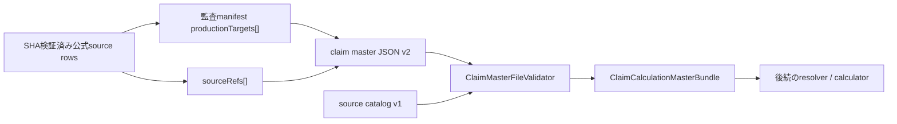

# Phase 3-1 Task 12 Claim Master Schema v2 Design

## 1. 目的

Task 13のsource-side schema auditで確認した次の13,950件の`schema-gap`を、公式上の意味を失わず保存できるclaim master schema v2へ再設計する。

| gap category | 件数 | 代表locator | 不足している能力 |
| --- | ---: | --- | --- |
| `numeric-composite-unit` | 13,539 | `r6-service-codes-2-xlsx / workbook-order=38;row=7` | service code、最終合成単位、算定条件を同じ請求行として保持する能力 |
| `unit-addition-or-other-operation` | 352 | `r6-service-codes-2-xlsx / workbook-order=38;row=941` | 固定単位加算、人数乗算、割合加算等を区別して保持する能力 |
| `condition-rate-calculation-structure` | 59 | `r6-service-codes-2-xlsx / workbook-order=38;row=908` | 基準単位へ条件付き乗率を順番・丸め境界付きで適用する能力 |

Task 12はschema、Domain型、validator及びtestsまでを対象とする。算定ルールの実行、公式値のseed転記、Task 13の再監査は後続Taskとする。

## 2. 設計判断

1. 6つのclaim masterファイルを`schemaVersion = 2`へ一括移行する。v1との後方互換及びv1/v2混在は認めない。
2. `sources.json`は別契約であるためsource catalog `schemaVersion = 1`を維持する。
3. 既存6 master kindを維持し、7番目の`calculation-rules.json`は追加しない。
4. 公式請求コード表の1論理行を`ServiceCodeMasterRow`の保存単位とし、service codeと算定ルールを同じentryへ保持する。
5. `ServiceCodeUnitRule`は`fixed-composite-unit`、`unit-addition`、`formula`の閉じたunionとする。
6. 全production entryの単一source fieldを、field単位の根拠を示す非空`sourceRefs`配列へ置き換える。
7. service code条件は期間付き`conditionDefinitions`で定義し、entryはkeyで参照する。
8. `service-codes`は公式請求行の正本、`basic-rewards`及び`additions`は正規化した算定componentとする。
9. manifestとの完全一致はrepository audit testで検証し、runtime validatorへmanifestを渡さない。
10. 共通validatorは期間逆転・重複を拒否するが、制度上のretirementを許可する。継続必須集合の穴はmaster別testで検査する。

## 3. 非対象

- `ServiceCodeUnitRule`の実行エンジン。
- composite unitの再計算と公式最終単位との数値一致。
- Task 13 production seedの投入。
- Task 13 manifest全14,709行の再分類。
- source catalog schemaの版上げ。
- 任意演算を記述できる汎用式AST。
- 公式資料の長文を計算fieldへ複製すること。

## 4. アーキテクチャ



### 4.1 責務境界

- JSON Schema v2はproperty、型、enum、union kind固有field及びadditional property禁止を検証する。
- Runtime validatorはsource catalog、正本、期間、condition、selector、component及び循環を検証する。
- Repository audit testはmanifestの`productionTargets`とproduction entryの`sourceRefs`を照合する。
- Runtime bundleはmanifestを保持しない。
- 後続calculatorはvalidator済みのtyped unionだけを受け取り、生JSON又は自由記述式を解釈しない。

## 5. Claim master file v2共通契約

6つのmasterファイルは次のrootを持つ。

```json
{
  "schemaVersion": "2",
  "masterKind": "service-codes",
  "entries": []
}
```

`service-codes.json`だけは追加で`conditionDefinitions`を必須にする。他のmaster kindでは同propertyを禁止する。

全entryの共通fieldは次とする。

```text
key
effectiveFrom
effectiveTo
sourceRefs[]
values
```

v1の`sourceDocumentId`、`sourceSha256`及び`sourceLocator`は廃止する。

## 6. Source provenance

### 6.1 Domain型

```text
ClaimSourceRef
  documentId
  sha256
  locator
  evidenceRole
  supports[]
```

`evidenceRole`は次の閉集合とする。

```text
authoritative
correction
cross-check
```

`supports`は非空・重複禁止とし、次の閉集合を使用する。

```text
service-identity
selectors
unit-rule
conditions
effective-period
master-values
```

### 6.2 必須coverage

- 全entryは`effective-period`を有効正本で覆う。
- service code entryは`service-identity`、`selectors`及び`unit-rule`を有効正本で覆う。
- `conditionSelectors`が非空のservice code entryは`conditions`を有効正本で覆う。
- condition definitionは`conditions`及び`effective-period`を有効正本で覆う。
- その他のmaster entryは`master-values`を有効正本で覆う。

### 6.3 有効正本の確定

各`supports`項目について有効正本をちょうど1件に確定する。

1. `cross-check`は正本候補にしない。
2. `correction`はsource catalogの`corrects` chainと一致しなければならない。
3. correction chainがある場合は末端documentを有効正本とする。
4. chain外のauthoritative documentが複数存在すれば拒否する。
5. 同じdocument、locator、evidence roleのrefを複数置かず、`supports`を1 refへ統合する。

## 7. Service code v2 Domain model

```text
ServiceCodeMasterRow
  Key
  ServiceCode
  OfficialLabel
  ServiceKind
  Selectors[]
  ConditionSelectors[]
  UnitRule
  ComponentRefs[]
  EffectiveFrom
  EffectiveTo
  SourceRefs[]
```

### 7.1 identity

- `OfficialLabel`は公式サービス内容略称を外側空白なしで保持する。
- 同じ適用期間の同一service codeに異なるofficial labelが存在する場合は拒否する。
- 公式labelを生成、翻訳又は正規化しない。
- `Selectors`と`ConditionSelectors`は非空文字列の重複なし配列とする。

### 7.2 billing unit

`BillingUnit`は次の閉集合とする。

```text
per-day
per-month
per-use
```

## 8. ServiceCodeUnitRule union

### 8.1 fixed-composite-unit

公式service code表が最終合成単位を数値で示す請求行を保持する。

```text
kind = fixed-composite-unit
finalUnits: positive integer
billingUnit: BillingUnit
```

代表fixture:

```text
r6-service-codes-2-xlsx / workbook-order=38;row=7
finalUnits = 837
billingUnit = per-day
```

`finalUnits`は請求コード表の最終単位であり、`BasicRewardMasterRow.BaseUnits`とは別の意味を持つ。

### 8.2 unit-addition

```text
kind = unit-addition
targetSelector
amount
calculationStepId
roundingRuleId
billingUnit
```

`amount`は次の閉じたnested unionとする。

```text
fixed-units
  addedUnits: positive integer

units-per-count
  unitsPerCount: positive integer
  countSelector: non-blank string

percentage-of-target
  percentage: canonical decimal string, greater than 0
```

代表fixture:

```text
r6-service-codes-2-xlsx / workbook-order=38;row=941
unitsPerCount = 93
countSelector = previous-year-six-month-employment-count
```

### 8.3 formula

任意ASTを許さず、基準単位へ条件付き乗率を順番に適用する閉じた構造とする。

```text
kind = formula
baseSelector
factors[]
billingUnit
```

各factorは次を持つ。

```text
order: positive integer
rate: canonical decimal string, greater than 0 and less than or equal to 1
conditionSelector
calculationStepId
roundingRuleId
```

契約:

- factorsは非空。
- orderは1始まりの連続値で重複不可。
- 1 factorを1算定stepとして扱う。
- `calculationStepId`と`roundingRuleId`がfactor適用後の丸め境界を決定する。
- chain末尾だけ丸める公式契約は専用のclosed `calculationStepId`で表す。
- `baseSelector`と`conditionSelector`は同じ適用期間を覆う参照先へ一意に解決する。
- 加算、減算又は未知operationをformulaへ混ぜない。

代表fixture:

```text
r6-service-codes-2-xlsx / workbook-order=38;row=908
rate = 0.7
condition = plan-not-created-first-two-months
```

## 9. Condition definitions

`service-codes.json`rootへ期間付きcondition definitionを持つ。

```text
conditionDefinitions[]
  key
  effectiveFrom
  effectiveTo
  kind
  operator
  value | values
  sourceRefs[]
```

### 9.1 closed condition contract

初期`kind`はTask 13 inventoryで必要な次の閉集合とする。

```text
reward-system
payment-band
capacity
staffing
average-wage-band
plan-status
shortage-duration
municipality-ownership
r8-reform-status
facility-classification
employment-outcome-count
```

`operator`は次の閉集合とする。

```text
equals
in
less-than
less-than-or-equal
greater-than
greater-than-or-equal
```

kindごとに`value`の型と許可operatorをvalidatorのclosed tableで固定する。未知kindを自由文字列として保存しない。

### 9.2 period contract

- 同じkeyの期間重複を拒否する。
- conditionは明示的に終了できる。
- service codeの全適用期間を各condition keyの定義がちょうど1件ずつ覆う。
- future conditionを過去月へ遡及しない。
- 未定義又は未使用condition definitionを拒否する。
- 同じentry内で矛盾するcondition集合を拒否する。

## 10. Component references

`service-codes`を公式請求行の正本、`basic-rewards`及び`additions`を正規化した算定componentとする。

```text
ComponentRef
  masterKind: basic-rewards | additions
  key
  role: base | adjustment
```

名称を次のように区別する。

```text
BasicRewardMasterRow.BaseUnits
FixedCompositeUnitRule.FinalUnits
UnitAdditionRule.AddedUnits / UnitsPerCount
```

validatorはcomponent key、期間coverage、role及び循環を検証する。Task 12ではcomponentを実行して`finalUnits`を再計算しない。

## 11. Manifest v2 mapping

source-side manifestの各rowで、旧`masterKind`、`seedKey`及びaggregation 3 fieldを廃止し、次を持つ。

```text
productionTargets[]
  masterKind
  seedKey
  mappingRole
  supports[]
  mappingReason
```

`mappingRole`は次の閉集合とする。

```text
primary
component
supporting-evidence
```

契約:

- `seed` rowはproduction targetを1件以上持つ。
- `excluded`及び`schema-gap` rowはtargetを持たない。
- `component`及び`supporting-evidence`は非空`mappingReason`を必須とする。
- 1 source rowから複数production entryへのprojectionは複数targetで表す。
- 複数source rowから1 production entryへの集約は同じ`masterKind + seedKey`を参照する。
- completenessはdistinct target key集合とproduction key集合を比較する。
- productionの各source refは同じdocument、locator及びsupportsを持つmanifest targetへ対応させる。

この照合はrepository audit testだけで行う。manifestをapplication resourceへ埋め込まない。

## 12. Period policy

### 12.1 共通runtime validation

- `effectiveFrom`と`effectiveTo`は包含月とする。
- 終了月が開始月より前なら拒否する。
- 同じkeyの有効期間重複を拒否する。
- 終了後に後継entryがないことを共通エラーにしない。

### 12.2 master別coverage

次のような継続必須集合はmaster別repository testでrelease期間内の穴を検査する。

- 地域単価の全地域区分。
- 負担上限の制度区分。
- office profile transition rule。

service code、condition definition及びadditionは公式終了月でretireできる。R6処遇改善加算（V）の2025-03終了を正常例として固定する。

## 13. Runtime validator

検証順序を固定する。

1. 期待する6ファイルの過不足。
2. 全6 masterが`schemaVersion = 2`であること。
3. JSON Schemaのclosed contractとunion shape。
4. source catalog v1、SHA及びsource refs。
5. supports単位の有効正本。
6. condition definitionの型、期間及び参照。
7. service identity、selector及びunit rule。
8. component参照と循環。
9. formula factorのorder、rate、step及びrounding。
10. entry keyと期間重複。

error messageは最低でもfile、entry又はcondition key、field及び参照先を含める。

14,000行規模で総当たり検証をしない。次をdictionary又はinterval indexへ事前構築する。

- entry key。
- service code。
- selector。
- condition keyと期間。
- component keyと期間。
- source documentとcorrection chain。

## 14. Domain bundle

`ClaimSourceLocator`を`ClaimSourceRef`へ置き換え、全master rowの`Source`を`SourceRefs`へ変更する。

`ClaimCalculationMasterBundle`は既存6 collectionに加えて、service code condition definitionsをtyped collectionとして保持する。

Task 12ではresolver又はcalculatorの公開APIを変更しない。後続Taskがv2 bundleへ対応する際にunit rule実行を導入する。

## 15. Test design

### 15.1 Domain contract tests

- 3 unit rule kindが全値を保持する。
- nested amount unionが種類別fieldを保持する。
- factorがstep及びrounding境界を保持する。
- source refs、supports、condition definition及びcomponent refsを保持する。
- `OfficialLabel`、`BaseUnits`及び`FinalUnits`の意味が混在しない。

### 15.2 Schema tests

- 完全なv2 synthetic bundleを受理する。
- v1 masterを拒否する。
- 6 master間のv1/v2混在を拒否する。
- source catalog v1を受理する。
- 未知field、未知union kind及びkind固有fieldの過不足を拒否する。
- canonical decimal string以外を拒否する。
- condition kindとoperatorの不正組合せを拒否する。

### 15.3 Validator tests

- source supportsの欠落を拒否する。
- cross-checkだけの正本確定を拒否する。
- valid correction chainの末端を採用する。
- chain外authoritativeの競合を拒否する。
- condition期間の重複、未定義、未使用及びservice期間未coverageを拒否する。
- component key不足、期間不足及び循環を拒否する。
- factor orderの穴・重複、rate範囲外、step／rounding不整合を拒否する。
- service code retirement及びcondition retirementを受理する。

### 15.4 Representative gap fixtures

次のSHA検証済みlocatorを設計fixtureとして使用する。

1. `r6-service-codes-2-xlsx / workbook-order=38;row=7`。
2. `r6-service-codes-2-xlsx / workbook-order=38;row=941`。
3. `r6-service-codes-2-xlsx / workbook-order=38;row=908`。

公式値を巨大fixtureへ複製せず、各unionの代表field、source ref、condition及びperiodだけを固定する。

### 15.5 Scale and audit tests

- 14,709件のsynthetic service entryをin-memory生成し、index構築型validatorで検証する。
- 実時間の厳格な秒数assertは置かない。
- manifest audit testはproduction target集合、source ref、supports及びmapping roleを照合する。
- Task 13は再監査で`schema-gap = 0`になるまでseedフェーズへ進めない。

## 16. 移行

現行6 seedは空であるため、v1 entryをv2へ変換するmigrationは作成しない。

Task 12 implementationでは次を同一candidate内で行う。

1. Domain型をv2へ変更する。
2. public JSON Schemaをv2へ置換する。
3. validatorをv2専用へ置換する。
4. 6 empty seedのschemaVersionを2へ変更する。
5. `service-codes.json`へ空`conditionDefinitions`を追加する。
6. Domain contract tests及びschema testsをv2へ更新する。
7. v1拒否と混在拒否を固定する。

source catalog及び`source-catalog.schema.json`は変更しない。

## 17. 影響範囲

### Task 12で変更する主要file

- `src/Tsumugi.Domain/Logic/Claim/Models/ClaimCalculationMasters.cs`
- `src/Tsumugi.Infrastructure/ClaimMasters/Schema/claim-master-file.schema.json`
- `src/Tsumugi.Infrastructure/ClaimMasters/ClaimMasterFileValidator.cs`
- `tests/Tsumugi.Domain.Tests/Logic/Claim/ClaimCalculationMasterContractTests.cs`
- `tests/Tsumugi.Infrastructure.Tests/ClaimMasters/ClaimMasterSchemaPhase31Tests.cs`
- `src/Tsumugi.Infrastructure/ClaimMasters/Seed/basic-rewards.json`
- `src/Tsumugi.Infrastructure/ClaimMasters/Seed/additions.json`
- `src/Tsumugi.Infrastructure/ClaimMasters/Seed/region-unit-prices.json`
- `src/Tsumugi.Infrastructure/ClaimMasters/Seed/burden-caps.json`
- `src/Tsumugi.Infrastructure/ClaimMasters/Seed/transition-rules.json`
- `src/Tsumugi.Infrastructure/ClaimMasters/Seed/service-codes.json`

`JsonClaimMasterProvider`又は関連testはbundle constructor変更で必要な最小範囲だけ更新する。

### Task 13再監査で変更するfile

- `docs/spec-data/phase3/claim-master-source-row-manifest.json`
- `tests/Tsumugi.Infrastructure.Tests/ClaimMasters/ClaimMasterSeedPhase31Tests.cs`

Task 12とTask 13 seed転記を同じcommitへ混ぜない。

## 18. 完了条件

- 全6 masterがv2で読み込まれ、v1及び混在版が拒否される。
- source catalog v1がそのまま利用できる。
- 3種類の代表gap fixtureがtyped Domain bundleへ損失なく読み込まれる。
- source supportsと有効正本がfail-closedで検証される。
- condition definitionが期間付きで一意に解決される。
- `BaseUnits`、`FinalUnits`及びunit addition値が区別される。
- component参照とformula参照の不足・期間外・循環が拒否される。
- service code及びconditionの明示的retirementが受理される。
- 14,709件scale fixtureがvalidatorを通る。
- focused tests及び`./build/ci.sh`が成功する。
- Task 13はschema-gap再監査が完了するまで停止状態を維持する。
